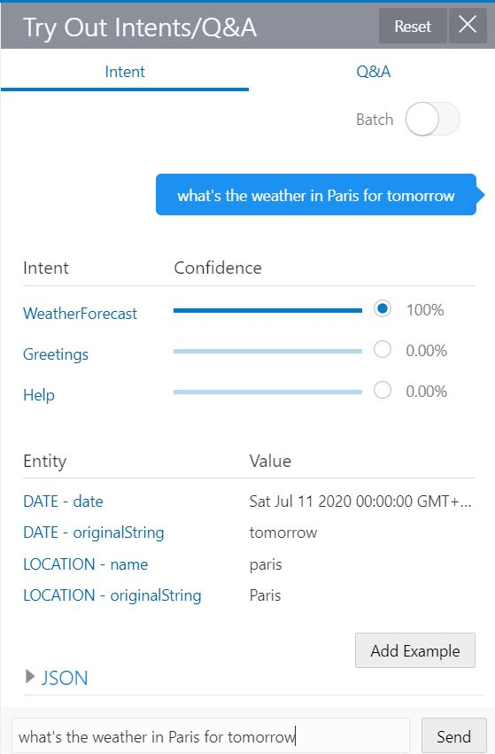

Now you just have to train the skill, test the intents and repeat! Chatbot training is a repetitive process where you will start with a few utterances and based on end user input, you can assign those phrases as utterances of an Intent.
For the hands-on, it will be enough with the utterances provided but keep that in mind for your live projects!

At the time of writing, there are two models available.
  * Trainer Ht: This one is a linguistic-based model that does not require a lot of utterances to disambiguate the intent.
  * Trainer Tm: On the other hand, Trainer Tm is a machine learing-based model. This is the one you usually want to be enabled when going live.

 Click on the 'Train' button and select 'Trainer Ht'.

Once the trainig has finnished, you can start testing. On the intents page, click on 'Test Utterances' link on the left hand side.

You can write the phrase on the tester and it will be evaluated, asigning a confidence percentage to each Intent.
You can try the following phrases.

| Phrases                                   |
| ------------------------------------------|
| What's the weather like?                  |
| is it snowing in Madrid?                  |
| Whats the weather in London for tomorrow? |

As you can see in the image below, if you provide a location and a date is it recognized and marked as an Entity.

Feel free to try out new phrases. If by any chance, the Confidence percentaqge is low (<60) or another intent is higher than the one you think it should recognize, you can click on 'Add Example' button and retrain the model.